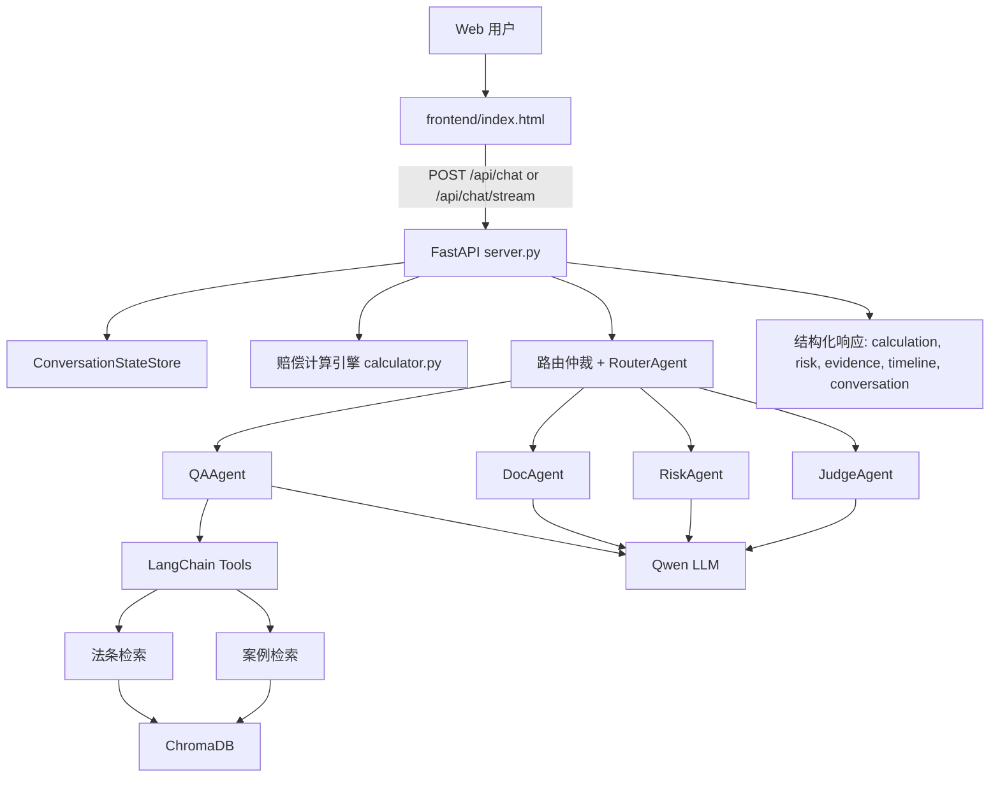

# 系统架构

## 总览

劳法智枢采用“确定性业务规则 + 多 Agent 生成能力 + RAG 检索增强”的架构。后端主链路先处理会话状态、事实抽取、赔偿计算和路由仲裁，再按意图调用对应子 Agent，最后统一生成结构化展示数据。



## 请求主链路

1. 接收 `query/session_id/preferred_mode/mode/force_mode`。
2. 从本地 JSON 读取该 `session_id` 的会话状态。
3. 从本轮输入抽取工资、年限、解除性质等案件事实，并与历史事实合并。
4. 尝试执行赔偿计算快路径；信息不足时返回缺失项。
5. 调用路由仲裁层决定 `effective_route` 和 `route_reason`。
6. 根据上下文策略决定是否给 Agent 注入前文案件状态。
7. 调用对应 Agent 或直接返回计算策略解释。
8. 构建结构化面板数据并持久化本轮会话状态。

## 路由仲裁优先级

普通 UI 模式只是偏好，不是硬强制。后端路由优先级如下：

1. `force_mode=true` 且 `mode` 合法时，严格使用 `mode`。
2. 明确文书意图：`doc`。
3. 明确赔偿计算意图：`qa` 计算快路径。
4. 明确风险评估意图：`risk`。
5. 明确案件预判/胜诉/策略意图：`judge`。
6. `preferred_mode/ui_mode`。
7. `RouterAgent` 关键词兜底，默认 `qa`。

## 会话状态

本地状态文件：`db/conversation_state.json`，已被 `.gitignore` 排除。

每个 `session_id` 保存：

```json
{
  "facts": {},
  "last_route": "qa",
  "last_calculation": {},
  "last_answer_preview": "",
  "turns": [],
  "updated_at": "2026-06-23T00:00:00+00:00"
}
```

写入采用临时文件 + `os.replace` 原子替换，降低 JSON 半写损坏风险。

## 上下文注入策略

上下文只在真正需要案件连续性的场景注入：

- `doc`：文书生成需要引用前文事实和金额。
- `risk`：风险评估需要结合已知案件事实。
- `judge`：案件预判需要沿用工资、年限、解除原因和计算结果。
- `qa` 且用户明确说“结合上面/这个案子/刚才”等连续语义。

普通法条/概念问答默认隔离前案，例如“劳动法第68条是什么”不会接收上次计算结果。

## 赔偿计算快路径

计算引擎在 `legal_ai_agent/tools/calculator.py` 中，优先确定性执行，避免“赔偿多少”被 LLM 或 UI 模式误路由。主链路会在进入 Agent 前尝试：

- 从当前问题抽取工资、年限、解除类型。
- 从同会话历史事实补齐缺失字段。
- 返回结构化金额、公式、工资基数、补偿月数、赔偿类型。

## RAG 检索

`legal_ai_agent/rag/vector_store.py` 提供：

- 法条按“第X条”切分并写入 metadata。
- Chroma 向量检索。
- 本地关键词和法条编号重排。

这使“劳动合同法第47条是什么”这类问题更容易命中准确法条。

